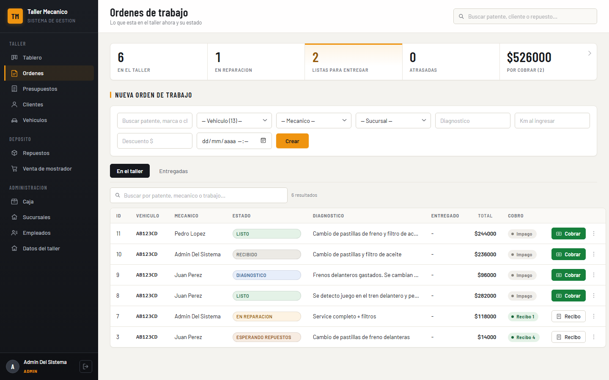

# Sistema de gestión para taller mecánico

Sistema de microservicios en Java y Spring Boot para administrar un taller
mecánico: órdenes de trabajo, presupuestos, depósito de repuestos, cobros y
venta de mostrador. Incluye una interfaz web en React.

Dos flujos de negocio comparten el mismo inventario: los repuestos que se usan
en una reparación y los que se venden sueltos por mostrador.



Hay una captura de cada pantalla en [docs/capturas](docs/capturas).

## Qué resuelve

**El circuito del taller.** Entra un vehículo con un problema, se le abre una
orden, se le cargan trabajos y repuestos, y va cambiando de estado hasta que se
entrega. Los repuestos salen del depósito en el momento en que se cargan y
vuelven si se sacan de la orden.

**Presupuestos con alternativas.** Se puede presupuestar el mismo trabajo con
dos o tres marcas de repuesto, cada una con su total, para que el cliente
elija. Al aceptar uno se genera la orden con la opción elegida.

**Cobros en dos pasos.** Registrar un cobro no es lo mismo que cobrarlo: queda
pendiente hasta que alguien confirma que la plata entró. Recién ahí se emite el
recibo, con su número correlativo. Un vehículo no se puede entregar si su orden
no está cobrada.

**Venta de mostrador.** Repuestos sueltos, sin orden de trabajo. El precio lo
pone el depósito y el stock se descuenta al cerrar la venta.

**Caja del día.** Cuánto entró, en qué medio de pago, qué quedó sin confirmar y
qué se anuló. Suma los cobros de las órdenes y las ventas de mostrador.

## Arquitectura

Cada servicio tiene su propia base de datos y no consulta las de los demás.
Entre servicios se hablan por HTTP, y el navegador habla solo con el gateway.

| Servicio | Puerto | Base de datos | De qué es dueño |
|---|---|---|---|
| eureka-server | 8761 | — | Registro de servicios |
| api-gateway | 8080 | — | Única puerta de entrada. Valida el token y enruta |
| usuarios-service | 8081 | `usuarios-service` | Sucursales, empleados, login, datos del taller |
| clientes-service | 8082 | `clientes-service` | Clientes y vehículos |
| taller-service | 8083 | `taller-service` | Órdenes, ítems, fotos, presupuestos |
| inventario-service | 8084 | `inventario-service` | Repuestos, stock, movimientos |
| pagos-service | 8085 | `pagos-service` | Cobros de órdenes |
| ventas-service | 8086 | `ventas-service` | Ventas de mostrador |

El repaso del patrón de microservicios, con lo que cumple está
en [docs/microservicios.md](docs/microservicios.md).

## Stack

- Java 25, Spring Boot 4.1
- Spring Cloud 2025.1 — Eureka, Gateway MVC, LoadBalancer
- MySQL 8, Flyway para el esquema
- JWT y BCrypt para autenticación
- React 18 con Vite, sin framework de estilos
- JUnit 5 y Mockito

## Cómo levantarlo

Hace falta Java 25, Maven, MySQL 8 y Node 20 o superior.

**1. Crear las bases de datos.** Vacías: el esquema lo arma Flyway al arrancar.

```sql
CREATE DATABASE `usuarios-service`;
CREATE DATABASE `clientes-service`;
CREATE DATABASE `taller-service`;
CREATE DATABASE `inventario-service`;
CREATE DATABASE `pagos-service`;
CREATE DATABASE `ventas-service`;
```

**2. Configurar las credenciales.** Copiar `.env.ejemplo` a `.env` y completar
las tres variables que pide: el usuario y la contraseña de MySQL, y la cadena
con la que se firman los tokens. El `.env` no se sube al repositorio.

**3. Arrancar los servicios.** En Windows:

```
arrancar.cmd
```

Levanta Eureka primero y después el resto. También se puede arrancar cada uno a
mano con `mvnw spring-boot:run` desde su carpeta, con las variables de entorno
ya definidas.

**4. Arrancar la interfaz.**

```
cd frontend
npm install
npm run dev
```

Queda en http://localhost:5173.

**5. Entrar.** La primera vez el sistema crea un administrador:

```
admin@taller.com / admin123
```

Conviene cambiar esa contraseña desde Empleados.

## Roles

Hay tres roles y la restricción se aplica en el gateway, no en el navegador.

| | Administrador | Vendedor / Mecánico |
|---|---|---|
| Órdenes, presupuestos, fotos, ítems | sí | sí |
| Clientes y vehículos: ver, crear, editar | sí | sí |
| Mover stock del depósito | sí | sí |
| Cobrar y vender por mostrador | sí | sí |
| Borrar cualquier cosa | sí | no |
| Anular un cobro o una venta | sí | no |
| Crear o editar repuestos y precios | sí | no |
| Empleados, sucursales, datos fiscales | sí | no |

Un empleado que deja el taller no se borra, se bloquea: pierde el acceso y todo
lo que hizo queda registrado a su nombre.

## Estructura

```
api-gateway/          puerta de entrada y validación del token
eureka-server/        registro de servicios
usuarios-service/     empleados, sucursales, login, configuración
clientes-service/     clientes y vehículos
taller-service/       órdenes, presupuestos, fotos
inventario-service/   repuestos y stock
pagos-service/        cobros
ventas-service/       ventas de mostrador
frontend/             interfaz React
docs/                 capturas y análisis de la arquitectura
```

Cada servicio sigue la misma estructura interna: `entity`, `dto`, `repository`,
`service` (interfaz e implementación), `controller` y `exception`.

## Tests

Cubren las reglas que manejan dinero y stock: que el monto de un cobro coincida
con el total de la orden, que el recibo se emita al confirmar y no antes, que
no se venda lo que no hay en el depósito, y que un vehículo no salga del taller
sin estar cobrado.

```
cd pagos-service && mvnw test
cd taller-service && mvnw test
cd ventas-service && mvnw test
```

## Estado del proyecto

Funciona de punta a punta.

La facturación electrónica de ARCA no está implementada. Los comprobantes que
emite el sistema son internos y no tienen valor fiscal.
